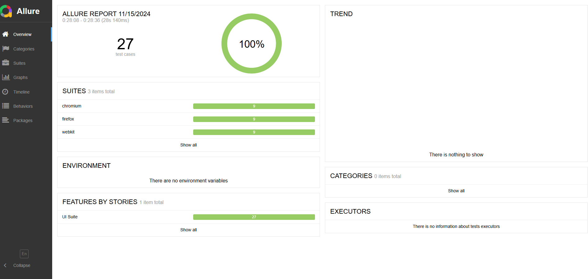
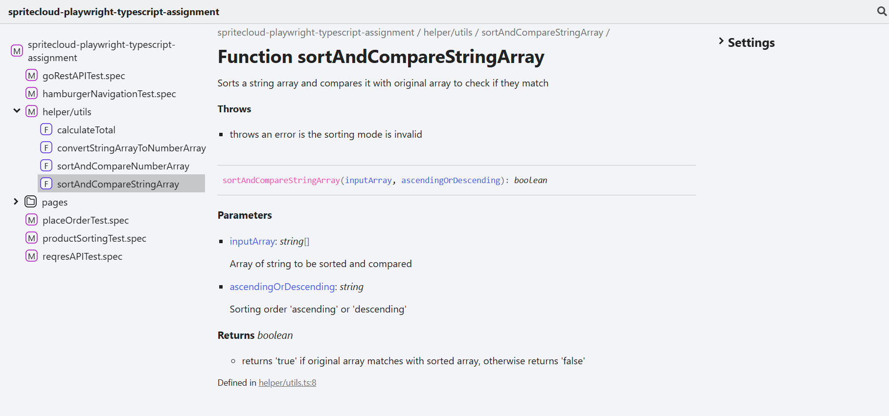
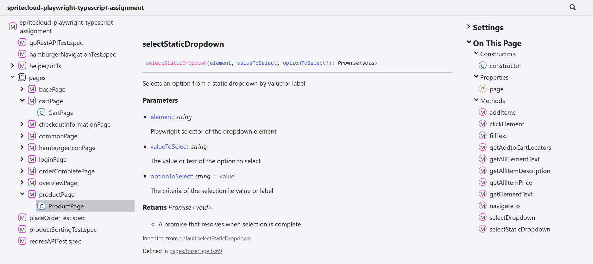

# SpriteCloud playwright typescript assignment
This repo is the playwright typescript automation for [Sauce demo](https://www.saucedemo.com/) application.
Below have mentioned the prerequisites and installation steps

## Pre-requisites
- node
- Typescript
- Java(ensure its added in Environmental variable)
- Any IDE (preferably VS Code)

## Installation
- Clone this repository
- Open the repository in IDE
- Open IDE terminal and run `npm install`(for installing dependencies) and `npx playwright install`(for installing playwright browsers)

## To run test and view report
- Run the command `npm run test`
- This command will run all the test against 3 browsers(chromium,webkit,firefox)
- Once the execution completes, the report will be automatically opening in the default browser as below

## To access documentation locally
- The project document is available in the `docs/` folder
- To access the documentation, navigate to docs directory in file explorer and open `index.html`

## To access online documentation
- To view online documentation please check,

## Project folder structure

### allure-report
- index.html -> Allure HTML report, which automatically opens in the default browser post test completion

### allure-results
-  Contains JSON report for each test execution

### fixures
-  pomFixtures.ts -> Customised Fixture file to override playwright default fixture

### node_modules
- Contains the installed dependencies source files

### playwright-report
- Contains the default playwright reports such has html report

### test-results
- Contains the test execution results such as traces,screenshot,video

### tests
- helper/utils.ts -> Contains the reuseable functions

- pages -> Contains the page object files for all the pages in Sauce demo website

- testData/constants.json -> Holds the constant data such as URL,Token,etc

- testData/sauceDemoTestData.json -> Holds the test data(user credentials)for sauce demo

- goRestAPITest.spec.ts -> API test to validate CRUD operations such as Get User,Create User, Update User,Delete User scenarios for [GoRestAPI](https://gorest.co.in/rest-console)

- reqresAPITest.spec.ts -> API test to validate Get User scenario [reqres.in](https://reqres.in)

- hamburgerNavigationTest.spec.ts -> Test that validates all 3 navigation links in the Hamburger icon

- placeOrderTest.spec.ts -> Test that validates the end to end functional flow of placing an order in sauce demo website

- productSortingTest.spec.ts -> Test that validates all 4 sorting functionalities(Description ascending/descending and Price ascending/descending) available in products page

### Root folder
- package.json and package-lock.json -> Dependency management file

- playwright.config.ts -> Holds the project level configuration of playwright
